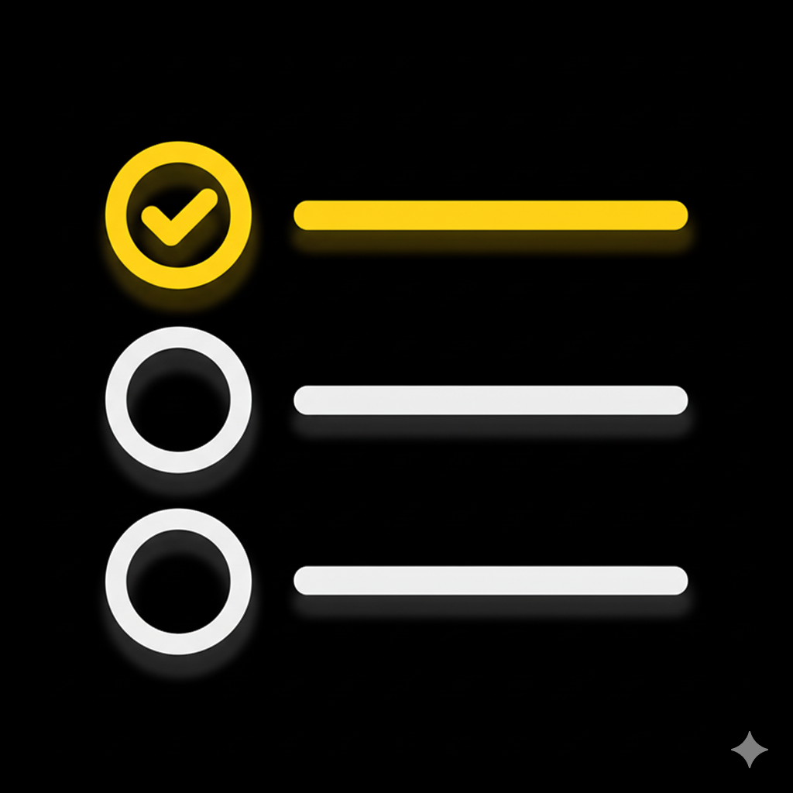

<b>English</b> | <a href="./README.md">Русский</a>

#  TodoList App

  
  
  
  
  
  

A modern to-do list application for iOS, built with SwiftUI. The project combines a clean, **Adapted VIPER** architecture, local data persistence with **CoreData**, and asynchronous networking using **Swift Concurrency**. A full suite of **unit tests** is implemented to ensure code reliability, and the commit history follows the **Conventional Commits** style. The app supports all CRUD operations, task searching, and gesture-based controls.

## ✨ Features

- **📝 Full CRUD Functionality:** Easily create, read, update, and delete tasks.
- **🔍 Smart Search:** Quickly find any task by its title or description.
- **💾 Data Persistence:** Tasks are reliably saved to a local **CoreData** database.
- **🌐 API Synchronization:** On the first launch, data is fetched from a remote API.

#### 🔥 Extra Features

- **Swipe Gestures:** Manage tasks intuitively—delete with a simple left swipe.
- **Pull-to-Refresh:** Update the task list just by pulling down the screen.
- **Sharing:** Share task details with other applications using the native share sheet.
- **Authentic UI:** The system's "Liquid Glass" feature (iOS 26+) has been disabled to maintain a more classic and clear interface.
- **Exit without Saving:** On the task creation/editing screen, you can exit without saving if no data has been entered.

## 🖼️ Preview

  

## 🏛️ Architecture: Adapted VIPER

The project is built on a modern adaptation of the **VIPER** architecture, optimized for SwiftUI. This ensures loose coupling, high testability, and scalability.

- **View (V):** A SwiftUI View responsible only for presentation.
- **Presenter (P):** An `@Observable` class that acts as the "brain" of the screen. It receives data from the Interactor, formats it for the View, and handles user actions. **In this adaptation, the Presenter also takes on some responsibilities of a ViewModel from MVVM** by managing the screen's state.
- **Interactor (I):** Contains all business logic, works with services (network, database), and is completely isolated from the UI.
- **Entity (E):** The data models.
- **Router (R):** Manages navigation logic.

## 🧵 Concurrency: Swift Concurrency

To ensure maximum performance and a responsive interface, all resource-intensive operations, such as network requests or CoreData database interactions, are performed asynchronously using **Swift Concurrency (`async/await`)**.

The database service (`CoreDataService`) is implemented as an **Actor**, guaranteeing thread-safe access to data from any part of the application.

## 🧪 Testing

The project has extensive test coverage, ensuring the stability and reliability of its business logic.

- **Unit Testing:** All components of each module (`TodoList` and `TodoDetail`) are unit-tested:
    - **Presenter Tests:** Verify display logic, data formatting, and reactions to user input.
    - **Interactor Tests:** Test the core business logic (fetching, saving, searching data) in isolation.
    - **Router Tests:** Check the correctness of navigation transitions.
- **Service Layer Testing:** Key services, including `CoreDataService` and `NavigationService`, are covered by tests.
- **Mocking:** An advanced mocking system is used for complete component isolation, replacing dependencies (services, routers, interactors) during tests.